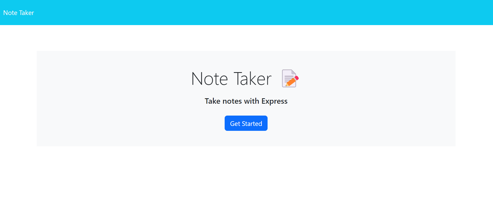
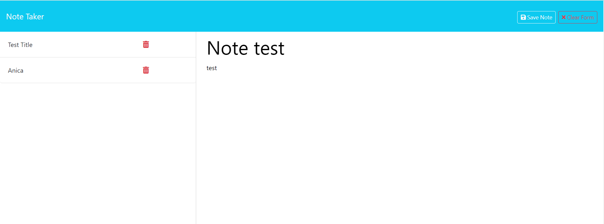
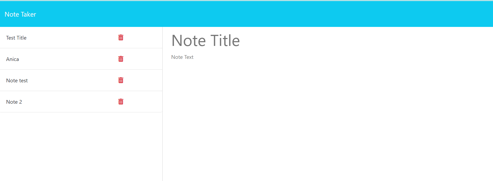

# Note-Taker
## Description

This application was designed to give users a place to store notes to help them organize their thoughts and to keep track of tasks they need to complete. It is powered by Express and implements an imitation database using a json file (db.json) to save and retrieve data.  I was responsible for connecting the backend and frontend of this application through the use of GET, POST, and DELETE requests within Express which allows users to save, retrieve, post new data, and delete data from the application by use of the front end user interface (UI). 
Through building this application, I learned some basic functionality of what Express can do and how powerful this framework can be when large scale databases interacting with APIs to send and retrieve data to one another.

## Table of Contents (Optional)

If your README is long, add a table of contents to make it easy for users to find what they need.

- [Installation](#installation)
- [Usage](#usage)
- [License](#license)

## Installation

Open in VS Code. If you do not have VS code you must install it. 

Using the terminal, install node.js v16. 

Once node.js v16 is installed, in the terminal, utilize the command npm init -y to initialize and create a package.json where project files will be stored. 

Next, use the terminal to run the command npm i to install the dependencies associated with this application. 

To run the server, within the terminal, type the command npm start or node server.js. 

Once the server is running, users can then access the front end of the application within the browser to observe full functionality of the site.

## Usage

This application is powered by Express meaning for it to function properly, there needs to be a server running in the background. To start the server, navigate to the directory of the application, install all dependencies (npm i), then type the command npm start (or node index.js). A message should then display in the command line saying "App listening at http://localhost:3001". Once the server is running, then navigate to the front end of the application directly from the command line by holding conreol key and clicking the link http://localhost:3001. From there, users can pull up any existing notes saved to the database or create new notes, which once saved will be pushed to the database and persisted.

[Link to a live application](https://note-taker-anica-a74997e580e0.herokuapp.com/notes) 

 
 
 
    

## License
MIT License

